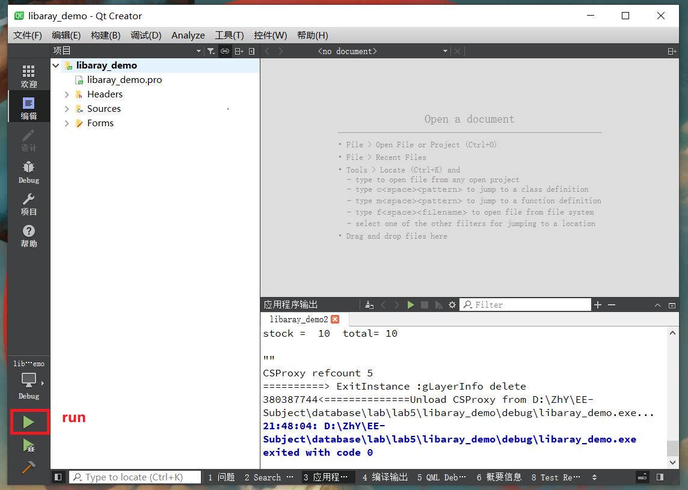

# BookManagementSystem


### Introduction

+ 以MySQL数据库作为数据存取工具，通过编程语言工具来包装数据库接口，设计一个交互式的图书管理系统，让用户能够通过与程序交互来模拟图书的借还等操作。
  - [详细介绍](https://github.com/Zhytou/BookManagementSystem/blob/main/res/lab.docx)
  - [实验报告](https://github.com/Zhytou/BookManagementSystem/blob/main/res/report.pdf)

### Entity Object

- 书
  - 书号、类别、书名、出版社、年份、作者、价格、总藏书量、库存
- 借书证
  - 卡号、姓名、单位、类别（教师/学生）
- 管理员（账号）
  - 管理员ID、密码、姓名、联系方式
- 借书记录
  - 书号、借书证号、借期，预计换期、经手人（管理员ID）

### Function

+ 管理员登陆
  - 输入管理员ID、密码; 成功登入系统 或 返回ID/密码错误
+ 图书入库
  - 单本入库 
  - 批量入库 
+ 图书查询
  - 能够根据属性（类别、书名、出版社、年份、作者、价格）进行查询，支持同时查询多个条件
  - 能够根据属性（类别、书名、出版社、年份、作者、价格）进行排序，默认是书名
+ 借书
  - 输入借书证卡号
    - 显示该借书证所有已借书籍
  - 输入书号
    * 如果该书在库存不为0，则借书成功，同时库存减1；否则输出该书无库存，且输出预计最快的归还时间
+ 还书
  - 输入借书证卡号
    * 显示该借书证所有已借书籍
  - 输入书号
    * 如果该书在已借书籍中，则还书成功；否则报错
+ 借书证管理
  - 增加或删除一个借书证

### Envoirment

+ 开发环境：Qt 5.9.9 + MySQL 5.7

### Build & Run

+ 建表

  ```sql
  use db_3180105151;
  
  create table book(
  bno int not null,
  type varchar(50) not null,
  title varchar(50) not null,
  author varchar(30) not null,
  year year,
  press varchar(30),
  price double,
  total int,
  stock int,
  primary key (bno));
  
  insert into book(bno,type,title,author,year,press,price,total,stock)
  values
  (1,"Computer Science","Database System Concepts","Abraham",2011,"McCrawHill",99,5,4),
  (2,"Computer Science","Modern Operating Systems","Andrew",2009,"Pearson",75,3,1),
  (3,"Computer Science","Computer Network","Tannenbaum",2000,"Pearson",58,4,3);
  
  create table card(
  cno int not null,
  name varchar(30) not null,
  department varchar(20) not null,
  type char(1) not null,
  primary key (cno)
  );
  
  insert into card(cno,name,department,type)
  values
  (1,"Jack","CS",'T'),
  (2,"Lily","Art",'S'),
  (3,"John","CS",'S'),
  (4,"Lucy","Physics",'S'),
  (5,"Any","Chemistry",'T');
  
  create table borrow(
  cno int not null,
  bno int not null,
  borrow_date date not null,
  return_date date not null,
  manager_id int not null
  );
  
  insert into borrow(cno,bno,borrow_date,return_date,manager_id)
  values
  (1,1,"2018-1-1","2018-1-14",1),
  (1,2,"2018-1-6","2018-1-10",1),
  (2,2,"2018-2-3","2018-2-8",2),
  (3,3,"2018-2-5","2018-3-1",2);
  
  
  create table manage(
  manager_id int not null,
  password varchar(20) not null,
  manager_name varchar(30) not null,
  phone_number char(11),
  primary key (manager_id)
  );
  
  insert into manage(manager_id,password,manager_name,phone_number)
  values
  (1,"12345","Jacob","13372530678"),
  (2,"12345","Emma","15928603168");
  
  
  drop table borrow;
  drop table book;
  drop table card;
  drop table manage;
  ```

+ 环境

  - Qt环境

+ 运行

  

### Result

**主界面**


**管理员登陆**


**借书证管理**


**单本入库**


