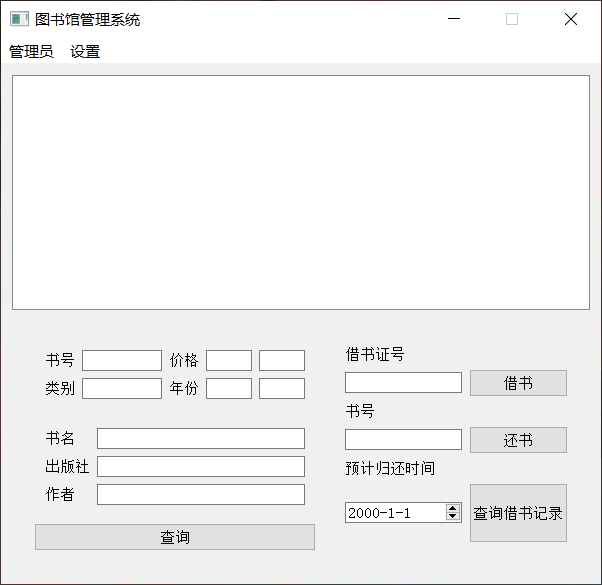
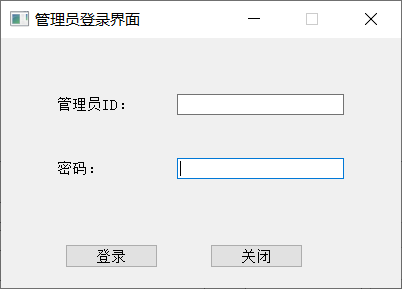
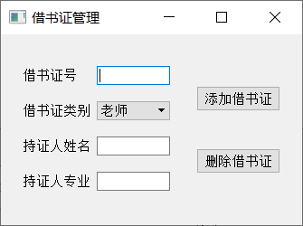
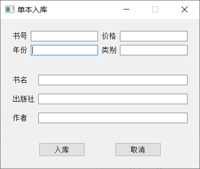

# BookManagementSystem

### Introduction

+ 以MySQL数据库作为数据存取工具，通过编程语言工具来包装数据库接口，设计一个交互式的图书管理系统，让用户能够通过与程序交互来模拟图书的借还等操作。

### Entity Object

- 书
  - 书号、类别、书名、出版社、年份、作者、价格、总藏书量、库存
- 借书证
  - 卡号、姓名、单位、类别（教师/学生）
- 管理员（账号）
  - 管理员ID、密码、姓名、联系方式
- 借书记录
  - 书号、借书证号、借期，预计换期、经手人（管理员ID）

### Function

+ 管理员登陆
  - 输入管理员ID、密码; 成功登入系统 或 返回ID/密码错误
+ 图书入库
  - 单本入库 
  - 批量入库 
+ 图书查询
  - 能够根据属性（类别、书名、出版社、年份、作者、价格）进行查询，支持同时查询多个条件
  - 能够根据属性（类别、书名、出版社、年份、作者、价格）进行排序，默认是书名
+ 借书
  - 输入借书证卡号
    - 显示该借书证所有已借书籍
  - 输入书号
    * 如果该书在库存不为0，则借书成功，同时库存减1；否则输出该书无库存，且输出预计最快的归还时间
+ 还书
  - 输入借书证卡号
    * 显示该借书证所有已借书籍
  - 输入书号
    * 如果该书在已借书籍中，则还书成功；否则报错
+ 借书证管理
  - 增加或删除一个借书证

### Envoirment

+ 开发环境：qt + MySQL

### Build & Run

+ 建表
+ 准备qt需要的MySQL库
+ 编译运行

### Result

**主界面**

**管理员登陆**

**借书证管理**

**单本入库**

